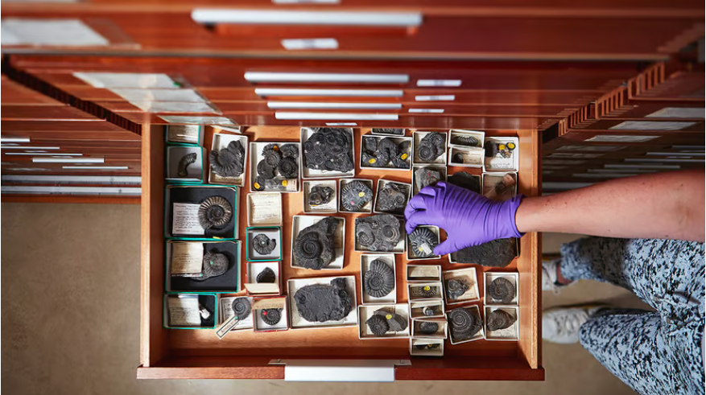

**注**：点击<a href="issue_1_en.md">此处</a>跳转英文原文

## 封面图

自然历史博物馆的一位托管人正在整理壁橱里的骨架

------

## 引文

我们平时去参观博物馆，但你有想过博物馆有多少文物吗？不可能仅仅是我们花一个下午的时间就能看到的那些吧！人类几千年的文明历史，需要多大的空间才能容纳？近年来，博物馆藏品的堆积问题引起了社会的注意，部分欧美国家采取了搬迁的办法保护文物，虽然过程令人繁琐并倍感压力，但这一搬迁工作也给了重新发现、重新评估和重新整理藏品的机会。

------

## 博物馆的囤积问题

伦敦自然历史博物馆哥特式的主厅下面是一座奇珍异宝的迷宫。博物馆的藏品中只有极少部分被展出--大约8千万文物中只有大概4万件(被展出)。许多藏品被放置在昏暗拥挤的地下室，这里有一只查尔斯-达尔文曾经拥有过的乌龟；还有数百罐巨型鱼和数千枚稀有贝壳。

大英自然博物馆生命科学收藏馆负责人克莱尔-瓦伦丁说："我们的空间已经不够用了，(除了地下室外，博物馆还依靠位于秘密地点的储藏室）。许多博物馆都存在囤积问题。大英博物馆只展出了1%的珍品，华盛顿史密森尼国家自然历史博物馆只展出了0.007%的珍品。存放在仓库中的珍宝通常会受到保护，但老式保险库中的藏品已满，岌岌可危。

解决办法之一是搬迁。国家自然历史博物馆正在进行世界上最大规模的藏品搬迁，2800万件藏品将被转移到位于雷丁的新中心。如果您认为打包陶器和老照片是件棘手的事，那么请想象一下搬运动物标本的情形：熊、长颈鹿和狮子需要玻璃纤维模具来保护它们的皮毛，还需要定制的木框。抵达后，这些动物将被冷冻三天，然后转移到经过崭新的消毒过的原始房间。瓦伦丁女士估计，整个搬迁过程将耗时七年。

大英博物馆已经将一些大型雕塑和镶嵌画转移到了同样位于雷丁的新存储中心。维多利亚与阿尔伯特博物馆、科学博物馆和阿什莫林博物馆也已将藏品运往新的建筑；在法国，巴黎国家自然历史博物馆的馆长们对将他们的藏品迁往第戎的计划怨声载道；在大西洋彼岸，麻省理工大学博物馆的150万件藏品的搬迁工作已进入最后阶段。

搬迁工作可能会给人带来压力，但也能给人提供重新发现、重新评估和重新整理藏品的机会。纽约大都会艺术博物馆承认，其伊斯兰艺术策展人从未见过其收藏的波斯地毯，因为它们被困在储藏室的后面。

另一方面，如果没有人知道那里有什么物品，那么一些物品丢失后可能需要一段时间才能发现。去年，一位手脚麻利的馆长从大英博物馆偷走了多达2000件藏品，并在eBay上出售了其中一些。威尔士的七家国家博物馆丢失了2000件文物，伦敦帝国战争博物馆丢失了500多件。

一些机构可能从未遗漏过零星的奇币或陶器碎片。即使是最庄严的博物馆，藏品目录也是过时的、不完整的。为填写货存清单而雇用的团队也在不断减少：过去50年间，国家历史博物馆的员工人数几乎翻了一番，但管理和研究藏品的比例却从55%降至15%。大英历史博物馆估计，以目前的工作人员数量，需要172年才能完成所有藏品的编目工作。不过，为搬迁而新组建的团队将建立一个详细的数据库，对搬迁后的藏品进行登记。

现代建筑还能以其他方式减少待办事项。在英国的一家博物馆，馆长要花一半的时间来检查文物是否被虫蛀。相比之下，新设施都有气候控制设施，并设有隔离区，以保护文物免受虫害。

对一些人来说，精心设计的新存储设施不过是装点门面而已。艺术品律师克里斯托弗-马里内罗说，博物馆保存的东西太多了。他认为，没有展出的文物应该捐赠或出售。印第安纳波利斯艺术博物馆使用排序系统处理了五分之一的藏品。藏品被打上从"A"到"D"的分数（从"稀有"到"劣质"），然后被存放、出售或报废。

这种方法适用于任何收藏品。但是，如果藏品一开始就具有吸引力，那么这种做法就会有帮助。出售一条腌鱼比出售一幅画更难。目前，许多博物馆的当务之急是把珍宝转移到更安全、更宽敞的地方。■

------

## 单词本

|                             单词                             | 文本意义 |                             单词                             |    文本意义    |
| :----------------------------------------------------------: | :------: | :----------------------------------------------------------: | :------------: |
| [labyrinth](https://dictionary.cambridge.org/zhs/词典/英语-汉语-简体/labyrinth) |   迷宫   | [ferry](https://dictionary.cambridge.org/zhs/词典/英语-汉语-简体/ferry?q=ferrying) |      运往      |
| [consigned](https://dictionary.cambridge.org/zhs/词典/英语-汉语-简体/consign) |   放置   | [grumble](https://dictionary.cambridge.org/zhs/词典/英语-汉语-简体/grumble?q=grumbling) |     发牢骚     |
| [hoarding](https://dictionary.cambridge.org/zhs/词典/英语-汉语-简体/hoarding?q=hoarding+) |   贮存   | [light-fingered](https://dictionary.cambridge.org/zhs/词典/英语-汉语-简体/light-fingered) |  有偷窃习惯的  |
| [crockery](https://dictionary.cambridge.org/zhs/词典/英语-汉语-简体/crockery) |   陶器   | [august](https://dictionary.cambridge.org/zhs/词典/英语-汉语-简体/august) |     庄严的     |
| [taxidermy](https://dictionary.cambridge.org/zhs/词典/英语-汉语-简体/taxidermy) |   标本   | [elaborate](https://dictionary.cambridge.org/zhs/词典/英语-汉语-简体/elaborate) |   精心设计的   |
| [bespoke](https://dictionary.cambridge.org/zhs/词典/英语-汉语-简体/bespoke) |  定制的  | [window dressing](https://dictionary.cambridge.org/zhs/词典/英语-汉语-简体/window-dressing) | 装饰门面的东西 |
| [pristine](https://dictionary.cambridge.org/zhs/词典/英语-汉语-简体/pristine) |  崭新的  | [stow](https://dictionary.cambridge.org/zhs/词典/英语-汉语-简体/stow?q=stowed) |      存储      |
| [sanitize](https://dictionary.cambridge.org/zhs/词典/英语-汉语-简体/sanitize?q=sanitised) |   消毒   | [pickled](https://dictionary.cambridge.org/zhs/词典/英语-汉语-简体/pickled) |     腌制的     |
| [mosaics](https://dictionary.cambridge.org/zhs/词典/英语-汉语-简体/mosaic?q=mosaics) |  镶嵌画  |                                                              |                |

------

​							     日期：2024-3-12
