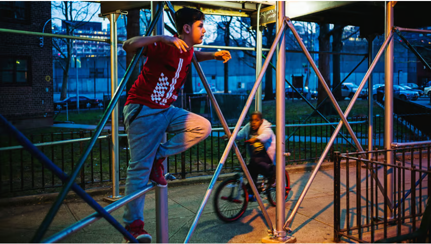

**注**：点击<a href="issue_2_en.md">此处</a>跳转英文原文

## 封面图

一名旅客正借助支架跳上地铁

------

## 引文

世界级大都市纽约正在为上世纪的遗留政策“买单”——1980年，政府官员对掉落的砖石造成的死亡感到震惊，于是强制每5年对建筑外墙进行一次检修，而现在遍布各处的未经许可的脚手架已令纽约市民深恶痛绝。

来自康纳尔大学的计算机科学团队训练了一种机器学习算法来帮助识别行车记录仪录像上的脚手架，待与政府机构合作后，纽约人又可以高枕无忧了。

------

## 纽约城里的脚手架

科技 | 施工中
纽约市到处都是非法脚手架
机器学习算法可帮助拆除它们

这座不夜城似乎也无法拆除脚手架。纽约人对这些丑陋的建筑以及为保护和疏导行人而设置的地面笼子已经深恶痛绝，因此纽约市长埃里克-亚当斯去年发起了一场清除街道上的脚手架的运动。

现在，该市的计算机科学家已经列出了一份可能的目标清单。研究人员利用AI技术筛选了数千小时的行车记录仪录像，确定了遍布五个行政区的约5000个脚手架搭设点，发现其中500个没有许可证。"参与该项目的曼哈顿康奈尔理工大学计算机科学家温迪-朱说："这座城市是最好，但也是一场灾难。"

纽约不断被淹没在脚手架下，是善意的政策产生不良副作用的典型例子。(1980年，官员们对砖石掉落造成的死亡感到震惊，于是开始强制每五年对建筑外墙进行一次检查。）

结果，城市记录显示，目前有超过8000个脚手架许可证，其中通常包括纽约人所说的 "棚子"--黑暗幽闭的街道隧道。许多脚手架在许可证过期很长时间后仍未拆除，因为建筑业主认为在两次检查之间将脚手架留在原地更为方便。亚当斯先生正在向棚架宣战，他庆祝拆除了哈莱姆区一条街道上已有21年历史的棚架，该棚架本身已成为当地的地标性建筑。

为了从街道层面了解这一问题，康奈尔大学的科学家们训练了一种算法来查找图像中的脚手架，然后让它处理共享汽车上安装的摄像头在2023年8月至2024年1月期间收集的大量数据。然后，他们要求计算机在29156833张巨大的地理标记图像中找到所有棚架。

研究人员接着将Ai识别出的脚手架与已批准项目的记录进行交叉对比。发现的大约500个未经许可的棚架并不一定违反规定，因为城市法规确实允许一些未经许可的棚架（例如用于紧急工程）。但这似乎是一个开始调查的好地方。

科学家们正在等待结果被即将召开的会议接受，然后再与市政官员分享。他们还想把这些数据转换成一张互动地图，向居民显示脚手架的位置，告诉他们脚手架已经存在了多久，并揭示脚手架是否有许可证。不久之后，纽约人又可以高枕无忧了。■

------

## 单词本

|                             单词                             |  文本意义  |                             单词                             |   文本意义   |
| :----------------------------------------------------------: | :--------: | :----------------------------------------------------------: | :----------: |
| <a href="https://dictionary.cambridge.org/zhs/%E8%AF%8D%E5%85%B8/%E8%8B%B1%E8%AF%AD-%E6%B1%89%E8%AF%AD-%E7%AE%80%E4%BD%93/scaffolding#google_vignette">scaffolding</a> |   脚手架   | <a href="https://dictionary.cambridge.org/zhs/%E8%AF%8D%E5%85%B8/%E8%8B%B1%E8%AF%AD-%E6%B1%89%E8%AF%AD-%E7%AE%80%E4%BD%93/masonry">masonry</a> |     砖头     |
| <a href="https://dictionary.cambridge.org/zhs/%E8%AF%8D%E5%85%B8/%E8%8B%B1%E8%AF%AD-%E6%B1%89%E8%AF%AD-%E7%AE%80%E4%BD%93/divert">divert</a> |    疏导    | <a href="https://dictionary.cambridge.org/zhs/%E8%AF%8D%E5%85%B8/%E8%8B%B1%E8%AF%AD-%E6%B1%89%E8%AF%AD-%E7%AE%80%E4%BD%93/facade?q=fa%C3%A7ade">façade</a> | 建筑物的正面 |
| <a href="https://dictionary.cambridge.org/zhs/%E8%AF%8D%E5%85%B8/%E8%8B%B1%E8%AF%AD-%E6%B1%89%E8%AF%AD-%E7%AE%80%E4%BD%93/pedestrian?q=pedestrians">pedestrian</a> |    行人    | <a href="https://dictionary.cambridge.org/zhs/%E8%AF%8D%E5%85%B8/%E8%8B%B1%E8%AF%AD-%E6%B1%89%E8%AF%AD-%E7%AE%80%E4%BD%93/claustrophobic">claustrophobic</a> |    幽闭的    |
| <a href="https://dictionary.cambridge.org/zhs/%E8%AF%8D%E5%85%B8/%E8%8B%B1%E8%AF%AD-%E6%B1%89%E8%AF%AD-%E7%AE%80%E4%BD%93/dash-cam?q=dashcam">dashcam</a> | 行车记录仪 | <a href="https://dictionary.cambridge.org/zhs/%E8%AF%8D%E5%85%B8/%E8%8B%B1%E8%AF%AD-%E6%B1%89%E8%AF%AD-%E7%AE%80%E4%BD%93/tunnel?q=tunnels">tunnel</a> |     隧道     |
| <a href="https://dictionary.cambridge.org/zhs/%E8%AF%8D%E5%85%B8/%E8%8B%B1%E8%AF%AD-%E6%B1%89%E8%AF%AD-%E7%AE%80%E4%BD%93/footage">footage</a> |    片段    | <a href="https://dictionary.cambridge.org/zhs/%E8%AF%8D%E5%85%B8/%E8%8B%B1%E8%AF%AD-%E6%B1%89%E8%AF%AD-%E7%AE%80%E4%BD%93/colossal">colossal</a> |    巨大的    |
| <a href="https://dictionary.cambridge.org/zhs/%E8%AF%8D%E5%85%B8/%E8%8B%B1%E8%AF%AD-%E6%B1%89%E8%AF%AD-%E7%AE%80%E4%BD%93/borough?q=boroughs">borough</a> |    市镇    | <a href="https://dictionary.cambridge.org/zhs/%E8%AF%8D%E5%85%B8/%E8%8B%B1%E8%AF%AD-%E6%B1%89%E8%AF%AD-%E7%AE%80%E4%BD%93/contravene">contravene</a> |     违反     |

------

​							日期：2024-3-15

